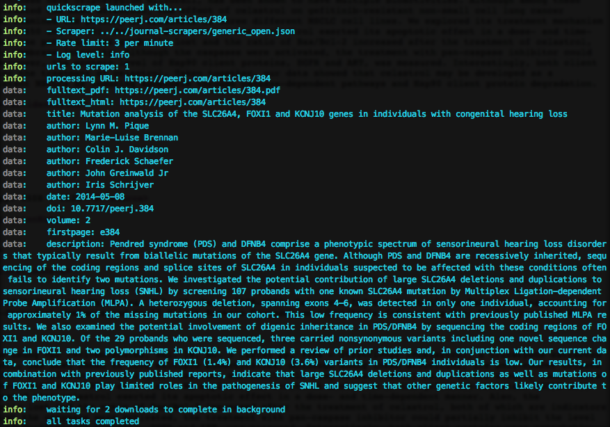
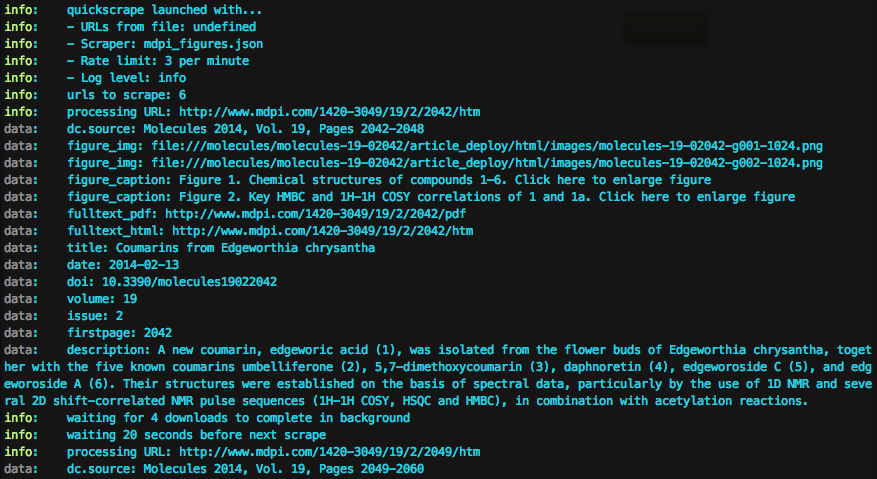

quickscrape
----

[][npm]
[][license]
[][travis]
[][gemnasium]
[][coveralls]

[npm]: http://badge.fury.io/js/quickscrape
[travis]: http://travis-ci.org/ContentMine/quickscrape
[coveralls]: https://coveralls.io/r/ContentMine/quickscrape
[gemnasium]: https://gemnasium.com/ContentMine/quickscrape
[license]: https://github.com/ContentMine/quickscrape/blob/master/LICENSE-MIT

`quickscrape` is a simple command-line tool for scraping websites. Scrapers are defined in JSON - no programming required! And pages are rendered in a headless browser, making it easier to browse like a real user.

**NOTE**: This is pre-alpha software. It works for some very specific test-cases and is under active development. Please wait until we're in beta to report issues.

## Installation

Install [NodeJS](http://nodejs.org/), [PhantomJS](http://phantomjs.org/) and [CasperJS](http://casperjs.org/), then install the module with: `npm install --global quickscrape`.

### Quick-start

#### OSX

With [Homebrew](http://brew.sh/), install dependencies:

```
brew update && brew install node phantomjs
brew install casperjs --devel
```

Install quickscrape

```
npm install --global quickscrape
```

<<<<<<< HEAD
#### Ubuntu / Debian
=======
If it fails run 
```
sudo npm install --global --unsafe-perm quickscrape
```

#### Debian
>>>>>>> 69d038184588251cd08e46e717d307a830eacf15

Simply run the command:

```
curl -sSL http://git.io/MN9b2A | sudo bash
```

If you'd like to inspect the install script and/or the steps yourself, see this [gist](https://gist.github.com/Blahah/827f183fb30ea5b6d571).

## Documentation

Run `quickscrape --help` from the command line to get help:

```

  Usage: quickscrape [options]

  Options:

    -h, --help              output usage information
    -V, --version           output the version number
    -u, --url <url>         URL to scrape
    -r, --urllist <path>    path to file with list of URLs to scrape (one per line)
    -s, --scraper <path>    path to scraper definition (in JSON format)
    -o, --output <path>     where to output results (directory will be created if it doesn't exist
    -r, --ratelimit <int>   maximum number of scrapes per minute (default 3)
    -l, --loglevel <level>  amount of information to log (silent, verbose, info*, data, warn, error, or debug)

```

You must provide scraper definitions in ScraperJSON format as used in the [ContentMine journal-scrapers](https://github.com/ContentMine/journal-scrapers).

## Examples

### 1. Extract data from a single URL with a predefined scraper

First, you'll want to grab some pre-cooked definitions:

```bash
git clone git@github.com:ContentMine/journal-scrapers.git
```

Now just run `quickscrape`:

```bash
quickscrape \
  --url https://peerj.com/articles/384 \
  --scraper journal-scrapers/peerj.json \
  --output peerj-384
```

You'll see log messages informing you how the scraping proceeds:



Then in the `output` directory (because we didn't specify a custom output path) there are several files:

```
$ ls output
384           384.pdf       rendered.html results.json
```

- `384` is the fulltext HTML (as in the case of PeerJ, there's no file extension)
- `384.pdf` is the fulltext PDF
- `rendered.html` is the fulltext HTML after rendering in the local browser
- `results.json` is a JSON file containing all the captured data

`results.json` looks like this:

```json
[
  {
    "fulltext_pdf": "https://peerj.com/articles/384.pdf"
  },
  {
    "fulltext_html": "https://peerj.com/articles/384"
  },
  {
    "title": "Mutation analysis of the SLC26A4, FOXI1 and KCNJ10 genes in individuals with congenital hearing loss"
  },
  {
    "author": "Lynn M. Pique"
  },
  {
    "author": "Marie-Luise Brennan"
  },
  {
    "author": "Colin J. Davidson"
  },
  {
    "author": "Frederick Schaefer"
  },
  {
    "author": "John Greinwald Jr"
  },
  {
    "author": "Iris Schrijver"
  },
  {
    "date": "2014-05-08"
  },
  {
    "doi": "10.7717/peerj.384"
  },
  {
    "volume": "2"
  },
  {
    "firstpage": "e384"
  },
  {
    "description": "Pendred syndrome (PDS) and DFNB4 comprise a phenotypic spectrum of sensorineural hearing loss disorders that typically result from biallelic mutations of the SLC26A4 gene. Although PDS and DFNB4 are recessively inherited, sequencing of the coding regions and splice sites of SLC26A4 in individuals suspected to be affected with these conditions often fails to identify two mutations. We investigated the potential contribution of large SLC26A4 deletions and duplications to sensorineural hearing loss (SNHL) by screening 107 probands with one known SLC26A4 mutation by Multiplex Ligation-dependent Probe Amplification (MLPA). A heterozygous deletion, spanning exons 4–6, was detected in only one individual, accounting for approximately 1% of the missing mutations in our cohort. This low frequency is consistent with previously published MLPA results. We also examined the potential involvement of digenic inheritance in PDS/DFNB4 by sequencing the coding regions of FOXI1 and KCNJ10. Of the 29 probands who were sequenced, three carried nonsynonymous variants including one novel sequence change in FOXI1 and two polymorphisms in KCNJ10. We performed a review of prior studies and, in conjunction with our current data, conclude that the frequency of FOXI1 (1.4%) and KCNJ10 (3.6%) variants in PDS/DFNB4 individuals is low. Our results, in combination with previously published reports, indicate that large SLC26A4 deletions and duplications as well as mutations of FOXI1 and KCNJ10 play limited roles in the pathogenesis of SNHL and suggest that other genetic factors likely contribute to the phenotype."
  }
]
```

### 2. Scraping a list of URLs

You can tell `quickscrape` to process a list of URLs using the same scraper.

You'll need a list of URLs. For example I've grabbed the URLs of the 5 most recently published articles in Molecules published by MDPI ([here's a script to get them yourself](https://gist.github.com/Blahah/e669f1d3899dcb392564)).

Create a file `urls.txt`:

```
http://www.mdpi.com/1420-3049/19/2/2042/htm
http://www.mdpi.com/1420-3049/19/2/2049/htm
http://www.mdpi.com/1420-3049/19/2/2061/htm
http://www.mdpi.com/1420-3049/19/2/2077/htm
http://www.mdpi.com/1420-3049/19/2/2089/htm
```

Say we want to extract basic metadata, PDFs, and all figures with captions. We can make a simple ScraperJSON scraper to do that, and save it as `molecules_figures.json`:

```json
{
  "url": "mdpi",
  "elements": {
    "dc.source": {
      "selector": "//meta[@name='dc.source']",
      "attribute": "content"
    },
    "figure_img": {
      "selector": "//div[contains(@id, 'fig')]/div/img",
      "attribute": "src",
      "download": true
    },
    "figure_caption": {
      "selector": "//div[contains(@class, 'html-fig_description')]"
    },
    "fulltext_pdf": {
      "selector": "//meta[@name='citation_pdf_url']",
      "attribute": "content",
      "download": true
    },
    "fulltext_html": {
      "selector": "//meta[@name='citation_fulltext_html_url']",
      "attribute": "content",
      "download": true
    },
    "title": {
      "selector": "//meta[@name='citation_title']",
      "attribute": "content"
    },
    "author": {
      "selector": "//meta[@name='citation_author']",
      "attribute": "content"
    },
    "date": {
      "selector": "//meta[@name='citation_date']",
      "attribute": "content"
    },
    "doi": {
      "selector": "//meta[@name='citation_doi']",
      "attribute": "content"
    },
    "volume": {
      "selector": "//meta[@name='citation_volume']",
      "attribute": "content"
    },
    "issue": {
      "selector": "//meta[@name='citation_issue']",
      "attribute": "content"
    },
    "firstpage": {
      "selector": "//meta[@name='citation_firstpage']",
      "attribute": "content"
    },
    "description": {
      "selector": "//meta[@name='description']",
      "attribute": "content"
    }
  }
}
```

Now run `quickscrape` with the `--urllist` option:

```bash
quickscrape \
  --urllist urls.txt \
  --scraper molecules_figures.json
```

You'll see output like:



Notice that `quickscrape` rate-limits itself to 3 scrapes per minute. This is a basic courtesy to the sites you are scraping - you wouldn't block the door of a library, so don't take up more than a reasonable share of a site's bandwidth.

Your results are organised into subdirectories, one per URL:

```bash
$ tree output
output/
├── http_www.mdpi.com_1420-3049_19_2_2042_htm
│   ├── htm
│   ├── molecules-19-02042-g001-1024.png
│   ├── molecules-19-02042-g002-1024.png
│   ├── pdf
│   ├── rendered.html
│   └── results.json
├── http_www.mdpi.com_1420-3049_19_2_2049_htm
│   ├── htm
│   ├── molecules-19-02049-g001-1024.png
│   ├── molecules-19-02049-g002-1024.png
│   ├── molecules-19-02049-g003-1024.png
│   ├── molecules-19-02049-g004-1024.png
│   ├── molecules-19-02049-g005-1024.png
│   ├── pdf
│   ├── rendered.html
│   └── results.json
├── http_www.mdpi.com_1420-3049_19_2_2061_htm
│   ├── htm
│   ├── molecules-19-02061-g001-1024.png
│   ├── molecules-19-02061-g002-1024.png
│   ├── molecules-19-02061-g003-1024.png
│   ├── molecules-19-02061-g004-1024.png
│   ├── pdf
│   ├── rendered.html
│   └── results.json
├── http_www.mdpi.com_1420-3049_19_2_2077_htm
│   ├── htm
│   ├── molecules-19-02077-g001-1024.png
│   ├── molecules-19-02077-g002-1024.png
│   ├── molecules-19-02077-g003-1024.png
│   ├── molecules-19-02077-g004-1024.png
│   ├── molecules-19-02077-g005-1024.png
│   ├── molecules-19-02077-g006-1024.png
│   ├── molecules-19-02077-g007-1024.png
│   ├── pdf
│   ├── rendered.html
│   └── results.json
└── http_www.mdpi.com_1420-3049_19_2_2089_htm
    ├── htm
    ├── molecules-19-02089-g001-1024.png
    ├── molecules-19-02089-g002-1024.png
    ├── pdf
    ├── rendered.html
    └── results.json

5 directories, 40 files
```

## Contributing

We are not yet accepting contributions, if you'd like to help please drop me an email (richard@contentmine.org) and I'll let you know when we're ready for that.

## Release History

- ***0.1.0*** - initial version with simple one-element scraping
- ***0.1.1*** - multiple-member elements; clean exiting; massive speedup
- ***0.1.2*** - ability to grab text or HTML content of a selected node via special attributes `text` and `html`
- ***0.1.3*** - refactor into modules, full logging suite, much more robust downloading
- ***0.1.4*** - multiple URL processing, bug fixes, reduce dependency list

## License
Copyright (c) 2014 Richard Smith-Unna  
Licensed under the MIT license.
