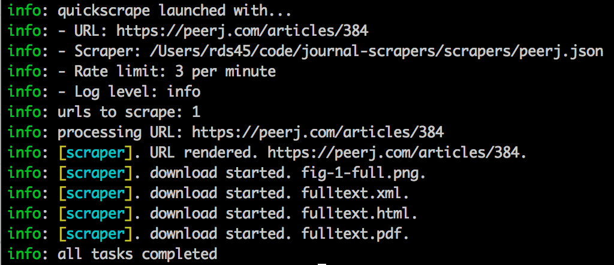

# quickscrape [][npm] [][license] [][downloads] [][travis]

[npm]: http://badge.fury.io/js/quickscrape
[travis]: http://travis-ci.org/ContentMine/quickscrape
[coveralls]: https://coveralls.io/r/ContentMine/quickscrape
[gemnasium]: https://gemnasium.com/ContentMine/quickscrape
[license]: https://github.com/ContentMine/quickscrape/blob/master/LICENSE-MIT
[downloads]: https://nodei.co/npm/quickscrape

`quickscrape` is a simple command-line tool for powerful, modern website scraping.

### Table of Contents

- [Description](#description)
- [Installation](#installation)
  - [OSX](#osx)
  - [Debian](#debian)
  - [Ubuntu](#ubuntu)
- [Documentation](#documentation)
- [Examples](#examples)
  - [1. Extract data from a single URL with a predefined scraper](#1-extract-data-from-a-single-url-with-a-predefined-scraper)
  - [2. Scraping a list of URLs](#2-scraping-a-list-of-urls)
- [Contributing](#contributing)
- [Release History](#release-history)
- [License](#license)

### Description

`quickscrape` is not like other scraping tools. It is designed to enable large-scale content mining. Here's what makes it different:

Websites are rendered in a GUI-less browser ([PhantomJS](http://phantomjs.org) via [CasperJS](http://casperjs.org)). This has some important benefits:

- Many modern websites are only barely specified in their HTML, but are rendered with Javascript after the page is loaded. Headless browsing ensures the version of the HTML you scrape is the same one human visitors would see on their screen.
- User interactions can be simulated. This is useful whenever content is only loaded after interaction, for example when article content is gradually loaded by AJAX during scrolling.
- The full DOM specification is supported (because the backend is WebKit). This means pages with complex Javascripts that use rare parts of the dom (for example, Facebook) can be rendered, which they cannot in most existing tools.

Scrapers are defined in separate JSON files that follow a defined structure. This too has important benefits:

- No programming required! Non-programmers can make scrapers using a text editor and a web browser with an element inspector (e.g. Chrome).
- Large collections of scrapers can be maintained to retrieve similar sets of information from different pages. For example: newspapers or academic journals.
- Any other software supporting the same format could use the same scraper definitions.

`quickscrape` is being developed to allow the community early access to the technology that will drive [ContentMine](http://contentmine.org), such as [ScraperJSON](https://github.com/ContentMine/journal-scrapers) and our Node.js scraping library [thresher](https://github.com/ContentMine/thresher).

The software is under rapid development, so please be aware there may be bugs. If you find one, please report it on the [issue tracker](https://github.com/ContentMine/quickscrape/issues).

### Installation

`quickscrape` is very easy to install. Simply:

```bash
sudo npm install --global quickscrape
```

However, `quickscrape` depends on [Node.js](http://nodejs.org), a platform which enables standalone JavaScript apps.

You'll need to install Node if you don't already have it before you can install quickscrape. Follow the instructions below. Currently we only support OSX and Debian/Ubuntu Linux. If you need instructions for another operating system please [create an issue](https://github.com/ContentMine/quickscrape/issues).

#### OSX

The simplest way to install Node.js on OSX is to go to  http://nodejs.org/download/, download and run the Mac OS X Installer.

Alternatively, if you use the excellent [Homebrew](http://brew.sh/) package manager, simply run:

```bash
brew update
brew install node
```

Then you can install quickscrape:

```
sudo npm install --global --unsafe-perms quickscrape
```

#### Debian

```bash
sudo apt-get update
sudo apt-get install -y nodejs nodejs-legacy
curl --insecure https://www.npmjs.org/install.sh | bash
```

Then you can install quickscrape

```bash
sudo -H npm install --global quickscrape
```

#### Ubuntu

```bash
sudo apt-get install -y software-properties-common build-essential python-software-properties libfontconfig1
sudo add-apt-repository -y ppa:chris-lea/node.js
sudo apt-get update
sudo apt-get install -y nodejs
```

Then you can install quickscrape:

```bash
sudo -H npm install --global quickscrape
```

### Documentation

Run `quickscrape --help` from the command line to get help:

```

  Usage: quickscrape [options]

  Options:

    -h, --help               output usage information
    -V, --version            output the version number
    -u, --url <url>          URL to scrape
    -r, --urllist <path>     path to file with list of URLs to scrape (one per line)
    -s, --scraper <path>     path to scraper definition (in JSON format)
    -d, --scraperdir <path>  path to directory containing scraper definitions (in JSON format)
    -o, --output <path>      where to output results (directory will be created if it doesn't exist
    -r, --ratelimit <int>    maximum number of scrapes per minute (default 3)
    -l, --loglevel <level>   amount of information to log (silent, verbose, info*, data, warn, error, or debug)

```

You must provide scraper definitions in ScraperJSON format as used in the [ContentMine journal-scrapers](https://github.com/ContentMine/journal-scrapers).

### Examples

#### 1. Extract data from a single URL with a predefined scraper

First, you'll want to grab some pre-cooked definitions:

```bash
git clone https://github.com/ContentMine/journal-scrapers.git
```

Now just run `quickscrape`:

```bash
quickscrape \
  --url https://peerj.com/articles/384 \
  --scraper journal-scrapers/scrapers/peerj.json \
  --output peerj-384
```

You'll see log messages informing you how the scraping proceeds:



Then in the `peerj-384` directory there are several files:

```
$ ls peerj-384
384           384.pdf       rendered.html results.json
```

- `384` is the fulltext HTML (as in the case of PeerJ, there's no file extension)
- `384.pdf` is the fulltext PDF
- `rendered.html` is the fulltext HTML after rendering in the local browser
- `results.json` is a JSON file containing all the captured data

`results.json` looks like this:

```json
[
  {
    "fulltext_pdf": "https://peerj.com/articles/384.pdf"
  },
  {
    "fulltext_html": "https://peerj.com/articles/384"
  },
  {
    "title": "Mutation analysis of the SLC26A4, FOXI1 and KCNJ10 genes in individuals with congenital hearing loss"
  },
  {
    "author": "Lynn M. Pique"
  },
  {
    "author": "Marie-Luise Brennan"
  },
  {
    "author": "Colin J. Davidson"
  },
  {
    "author": "Frederick Schaefer"
  },
  {
    "author": "John Greinwald Jr"
  },
  {
    "author": "Iris Schrijver"
  },
  {
    "date": "2014-05-08"
  },
  {
    "doi": "10.7717/peerj.384"
  },
  {
    "volume": "2"
  },
  {
    "firstpage": "e384"
  },
  {
    "description": "Pendred syndrome (PDS) and DFNB4 comprise a phenotypic spectrum of sensorineural hearing loss disorders that typically result from biallelic mutations of the SLC26A4 gene. Although PDS and DFNB4 are recessively inherited, sequencing of the coding regions and splice sites of SLC26A4 in individuals suspected to be affected with these conditions often fails to identify two mutations. We investigated the potential contribution of large SLC26A4 deletions and duplications to sensorineural hearing loss (SNHL) by screening 107 probands with one known SLC26A4 mutation by Multiplex Ligation-dependent Probe Amplification (MLPA). A heterozygous deletion, spanning exons 4–6, was detected in only one individual, accounting for approximately 1% of the missing mutations in our cohort. This low frequency is consistent with previously published MLPA results. We also examined the potential involvement of digenic inheritance in PDS/DFNB4 by sequencing the coding regions of FOXI1 and KCNJ10. Of the 29 probands who were sequenced, three carried nonsynonymous variants including one novel sequence change in FOXI1 and two polymorphisms in KCNJ10. We performed a review of prior studies and, in conjunction with our current data, conclude that the frequency of FOXI1 (1.4%) and KCNJ10 (3.6%) variants in PDS/DFNB4 individuals is low. Our results, in combination with previously published reports, indicate that large SLC26A4 deletions and duplications as well as mutations of FOXI1 and KCNJ10 play limited roles in the pathogenesis of SNHL and suggest that other genetic factors likely contribute to the phenotype."
  }
]
```

#### 2. Scraping a list of URLs

You can tell `quickscrape` to process a list of URLs using the same scraper.

You'll need a list of URLs. For example I've grabbed the URLs of the 5 most recently published articles in Molecules published by MDPI ([here's a script to get them yourself](https://gist.github.com/Blahah/e669f1d3899dcb392564)).

Create a file `urls.txt`:

```
http://www.mdpi.com/1420-3049/19/2/2042/htm
http://www.mdpi.com/1420-3049/19/2/2049/htm
http://www.mdpi.com/1420-3049/19/2/2061/htm
http://www.mdpi.com/1420-3049/19/2/2077/htm
http://www.mdpi.com/1420-3049/19/2/2089/htm
```

Say we want to extract basic metadata, PDFs, and all figures with captions. We can make a simple ScraperJSON scraper to do that, and save it as `molecules_figures.json`:

```json
{
  "url": "mdpi",
  "elements": {
    "dc.source": {
      "selector": "//meta[@name='dc.source']",
      "attribute": "content"
    },
    "figure_img": {
      "selector": "//div[contains(@id, 'fig')]/div/img",
      "attribute": "src",
      "download": true
    },
    "figure_caption": {
      "selector": "//div[contains(@class, 'html-fig_description')]"
    },
    "fulltext_pdf": {
      "selector": "//meta[@name='citation_pdf_url']",
      "attribute": "content",
      "download": true
    },
    "fulltext_html": {
      "selector": "//meta[@name='citation_fulltext_html_url']",
      "attribute": "content",
      "download": true
    },
    "title": {
      "selector": "//meta[@name='citation_title']",
      "attribute": "content"
    },
    "author": {
      "selector": "//meta[@name='citation_author']",
      "attribute": "content"
    },
    "date": {
      "selector": "//meta[@name='citation_date']",
      "attribute": "content"
    },
    "doi": {
      "selector": "//meta[@name='citation_doi']",
      "attribute": "content"
    },
    "volume": {
      "selector": "//meta[@name='citation_volume']",
      "attribute": "content"
    },
    "issue": {
      "selector": "//meta[@name='citation_issue']",
      "attribute": "content"
    },
    "firstpage": {
      "selector": "//meta[@name='citation_firstpage']",
      "attribute": "content"
    },
    "description": {
      "selector": "//meta[@name='description']",
      "attribute": "content"
    }
  }
}
```

Now run `quickscrape` with the `--urllist` option:

```bash
quickscrape \
  --urllist urls.txt \
  --scraper molecules_figures.json
```

You'll see output like:


Notice that `quickscrape` rate-limits itself to 3 scrapes per minute. This is a basic courtesy to the sites you are scraping - you wouldn't block the door of a library, so don't take up more than a reasonable share of a site's bandwidth.

Your results are organised into subdirectories, one per URL:

```bash
$ tree output
output/
├── http_www.mdpi.com_1420-3049_19_2_2042_htm
│   ├── htm
│   ├── molecules-19-02042-g001-1024.png
│   ├── molecules-19-02042-g002-1024.png
│   ├── pdf
│   ├── rendered.html
│   └── results.json
├── http_www.mdpi.com_1420-3049_19_2_2049_htm
│   ├── htm
│   ├── molecules-19-02049-g001-1024.png
│   ├── molecules-19-02049-g002-1024.png
│   ├── molecules-19-02049-g003-1024.png
│   ├── molecules-19-02049-g004-1024.png
│   ├── molecules-19-02049-g005-1024.png
│   ├── pdf
│   ├── rendered.html
│   └── results.json
├── http_www.mdpi.com_1420-3049_19_2_2061_htm
│   ├── htm
│   ├── molecules-19-02061-g001-1024.png
│   ├── molecules-19-02061-g002-1024.png
│   ├── molecules-19-02061-g003-1024.png
│   ├── molecules-19-02061-g004-1024.png
│   ├── pdf
│   ├── rendered.html
│   └── results.json
├── http_www.mdpi.com_1420-3049_19_2_2077_htm
│   ├── htm
│   ├── molecules-19-02077-g001-1024.png
│   ├── molecules-19-02077-g002-1024.png
│   ├── molecules-19-02077-g003-1024.png
│   ├── molecules-19-02077-g004-1024.png
│   ├── molecules-19-02077-g005-1024.png
│   ├── molecules-19-02077-g006-1024.png
│   ├── molecules-19-02077-g007-1024.png
│   ├── pdf
│   ├── rendered.html
│   └── results.json
└── http_www.mdpi.com_1420-3049_19_2_2089_htm
    ├── htm
    ├── molecules-19-02089-g001-1024.png
    ├── molecules-19-02089-g002-1024.png
    ├── pdf
    ├── rendered.html
    └── results.json

5 directories, 40 files
```

### Contributing

We are not yet accepting contributions, if you'd like to help please drop me an email (richard@contentmine.org) and I'll let you know when we're ready for that.

### Release History

- ***0.1.0*** - initial version with simple one-element scraping
- ***0.1.1*** - multiple-member elements; clean exiting; massive speedup
- ***0.1.2*** - ability to grab text or HTML content of a selected node via special attributes `text` and `html`
- ***0.1.3*** - refactor into modules, full logging suite, much more robust downloading
- ***0.1.4*** - multiple URL processing, bug fixes, reduce dependency list
- ***0.1.5*** - fix bug in bubbling logs up from PhantomJS
- ***0.1.6*** - add dependency checking option
- ***0.1.7*** - fix bug where jsdom rendered external resources (#10)
- ***0.2.0*** - core moved out to separate library: [thresher](https://github.com/ContentMine/thresher). PhantomJS and CasperJS binaries now managed through npm to simplify installation.
- ***0.2.1*** - fix messy metadata
- ***0.2.3*** - automatic scraper selection
- ***0.2.4-5*** - bump thresher dependency for bug fixes
- ***0.2.6-7*** - new Thresher API
- ***0.2.8*** - fix Thresher API use
- ***0.3.0*** - use Thresher 0.1.0 and scraperJSON 0.1.0
- ***0.3.1*** - update the reported version number left out of last release
- ***0.3.2*** - fix dependencies

### License

Copyright (c) 2014 Shuttleworth Foundation
Licensed under the MIT license.
